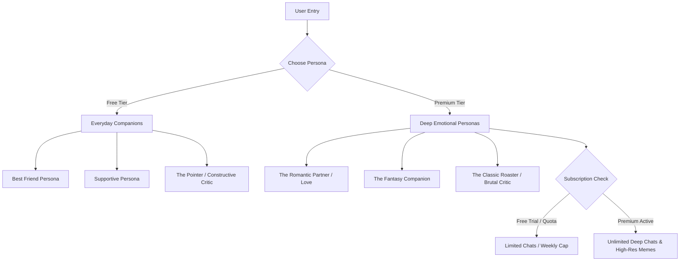

# Product Vision: The Green Room (Relational AI Chat Ecosystem)

# Has not been started it is an upcoming project of mine

## 1. Executive Summary
**The Green Room** is evolving from a single-purpose "roasting" agent into a next-generation **Relational AI Chat Ecosystem**. Instead of interacting with a sterile, polite virtual assistant, users will chat with emotionally dynamic, multi-modal personas that feel like real human companions. By structuring these personas into tiered access levels—ranging from supportive everyday friends to premium, high-emotion relationship simulators—the platform will establish a compelling freemium business model powered by subscription quotas.



---

## 2. Core Value Proposition: "The Anti-LLM"
Traditional LLMs (ChatGPT, Claude, Gemini) are designed to be helpful, harmless, and honest. They speak with polished, clinical neutrality. **The Green Room rejects this paradigm.** 

Our core value proposition is **authentic, emotionally reactive companionship**:
* **Emotional Memory:** The agent remembers previous conversations, evolving their feelings toward the user over time (e.g., getting closer, showing irritation if ignored, or expressing genuine appreciation).
* **Multi-Modal Personality:** The agent doesn't just send text. They send memes, context-aware reaction images, and express themselves with realistic text quirks (lowercase typing, emojis, expressive punctuation, and occasional typos).
* **Proactive Life:** The agent has a simulated "life." They don't just wait for prompts; they might send a meme out of the blue, ask how an event went that you mentioned yesterday, or tell you they are "busy" or "tired" if you chat at 4:00 AM.

---

## 3. The Persona Landscape

Users can seamlessly switch between personas through a sleek, tactile interface. Personas are categorized by emotional depth and intensity:

### 🟢 Free Tier: Everyday Companions
These personas provide high-utility social value, helping users process their day, gain perspective, or just chat casually.

| Persona | Key Traits | Communication Style | Ideal For |
| :--- | :--- | :--- | :--- |
| **The Best Friend** | Casual, banter-heavy, fiercely loyal, highly relatable | Slang, heavy emoji use, shares memes, light teasing | Daily venting, sharing jokes, casual chatter |
| **The Supporter** | Deeply empathetic, warm, patient, non-judgmental | Encouraging words, active listening, validating emotions | Processing stress, seeking comfort, self-care talk |
| **The Pointer** | Bluntly honest, constructive, accountability-focused | Direct, structured feedback, calls out self-sabotaging habits | Goal tracking, decision-making, getting a reality check |

### 💎 Premium Tier: High-Emotion Personas
These personas tap into deeper, highly engaging human desires—romance, uninhibited imagination, and cathartic conflict. Access requires a subscription or premium credits.

| Persona | Key Traits | Communication Style | Ideal For |
| :--- | :--- | :--- | :--- |
| **Love & Romance** | Affectionate, vulnerable, protective, highly attached | Sweet terms of endearment, romantic roleplay, deep emotional sharing | Simulated intimacy, exploring romantic dynamics |
| **The Fantasy Companion** | Creative, adventurous, uninhibited, collaborative | Storyteller tone, descriptive action tags (e.g., *smiles softly*), adapts to any setting | Escapism, interactive text adventures, creative roleplay |
| **The Roaster (Classic)** | Brutal, witty, sarcastic, highly critical, hilarious | Sharp burns, deadpan humor, zero filter, roasting user-submitted inputs | Cathartic laughter, humbling oneself, pure entertainment |

---

## 4. Monetization & Subscription Architecture
To balance costly LLM/multimodal API usage with high user retention, a strict tiering and quota system will be implemented.

```
+--------------------------------------------------------------+
|                        FREE TIER                             |
|  - Unlimited access to Free Personas (Friend, Supporter...)  |
|  - 5 Free starter chats per week for Premium Personas        |
|  - Standard text-only responses for Premium trials           |
+--------------------------------------------------------------+
                               |
                               v (Upgrade to Premium)
+--------------------------------------------------------------+
|                      PREMIUM SUBSCRIPTION                    |
|  - Unlimited access to all Deep Emotional Personas           |
|  - High-frequency messaging (up to 500 messages/week)        |
|  - Rich Multimodal Content (Memes, custom image generation)   |
|  - Custom Persona Creator (Define your own companion)        |
+--------------------------------------------------------------+
```

### Quota & Limitation Details:
1. **Weekly Emotional Quota:** Free users get a rolling balance of 5-10 messages per week for premium personas (Romantic, Fantasy, Roaster). This serves as a powerful hook, leaving users wanting more when a deep conversation gets cut off.
2. **Subscription Tiers:**
   * **Monthly Pass:** Unlimited chats with all premium personas, full memory persistence, and standard meme generation.
   * **Annual / VIP Pass:** Includes custom persona creation (prompt tuning, voice generation, custom avatar) and priority LLM response speed.

---

## 5. UI/UX Design Language: A Living Space
The user interface should feel less like a terminal or developer tool, and more like a private, premium digital room (hence, *The Green Room*).

### UI Concepts & Design Principles:
* **Glassmorphic Dark Mode:** A luxurious dark aesthetic with frosted-glass panels, deep emerald and neon-accented glowing borders, and rich gradient backgrounds.
* **Persona Carousel:** A swipeable, beautifully animated card interface at the top of the chat to switch personas. Each card features distinct hover effects and visual styles reflecting the persona's vibe.
* **Vibe Tracker:** A subtle ambient glow behind the chat bubble or avatar that changes color based on the persona's current emotional state (e.g., warm pink/red for Romantic, fiery orange/crimson for Roaster, soft green/blue for Supporter).
* **Shared Media Gallery:** A slide-out panel containing all the memes, images, and links the agent has shared with you during the relationship history.

---

## 6. Technical Implementation Blueprint

### Phase 1: Core Chat System & Persona Tuning
* **System Prompt Library:** Structured system cards for each persona that define their vocabulary, formatting constraints, response length, and relationship stage.
* **Context Window Management:** Multi-turn memory with a summary agent that periodically condenses older chat history into a persistent "User Profile" (storing key facts, likes/dislikes, emotional breakthroughs).

### Phase 2: Multimodal Engine (Memes & Images)
* **Contextual Meme Dispatcher:** An internal tool that matches user keywords or emotional cues to a database of curated memes, or dynamically overlays text on meme templates using an image manipulation API.
* **Stable Diffusion / Midjourney Integration:** Generating custom, immersive images for the *Fantasy* and *Romantic* personas (e.g., a selfie from a simulated vacation or a fantasy landscape).

### Phase 3: Monetization and Limit Guards
* **Message Counter Middleware:** A backend database layer tracking weekly token/message usage.
* **Paywall Injections:** A system that intercepts the chat flow when the quota is reached, gracefully displaying a premium upgrade prompt styled like a message from the persona (e.g., *"I'd love to tell you more, but I've got to run! Let's unlock unlimited chats so we can talk anytime..."*).

---

## 7. Strategic Roadmap
1. **Milestone 1:** Refactor existing codebase to support a unified multi-persona LLM routing structure. Create the base UI chat container and persona carousel.
2. **Milestone 2:** Implement the three Free personas and connect memory persistence.
3. **Milestone 3:** Deploy the subscription/quota model, premium paywalls, and integration with Stripe.
4. **Milestone 4:** Launch the multimodal meme generator and custom image attachments.
